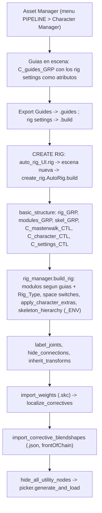

# autorig_tools: indice de documentacion

> Punto de entrada. Reglas de trabajo: `CLAUDE.md` y `.claude/rules/`.
> Hijos: `maya_tools/`, `ue_tools/`, `.claude/skills/como_funciona.md`, `docs/`.
> Las hojas por carpeta de `maya_tools/scripts` se crean en la Fase 2
> (`docs/plan_workflow.md`); mientras, las referencias de las skills.

---

## Vision general

Autorig modular para Maya 2025+ en Python. Cuatro ideas lo definen:

- **Rig por matrices**: `offsetParentMatrix`, `multMatrix`, grupos offset. Sin
  constraints clasicos. Ribbons de Boor propios (`utils/ribbon.py`) en vez de
  follicles.
- **Build data-driven**: cada personaje tiene `.guides` + `.build` en
  `maya_tools/assets/<personaje>/`; el build lee eso y construye los modulos
  cuyas guias existen. Nada de posiciones en el codigo.
- **Deformacion**: skinCluster (`.skc` versionado) + ribbons matriciales +
  corrective joints por nodos. AdonisFX para simulacion.
- **Export**: esqueleto `_ENV` en `skeletonHierarchy_GRP` + morphs. Notas de
  Unreal en `ue_tools/docs/`.

```
autorig_tools/
|-- CLAUDE.md                     flujo obligatorio + indice de entrada
|-- como_funciona.md              este fichero
|-- .claude/rules/                reglas cortas, una por tema
|-- .claude/skills/               conocimiento de dominio (6 skills)
|-- docs/                         plan de workflow y docs transversales
|-- maya_tools/
|   |-- self_module.mod           modulo de Maya: registra maya_tools y el PYTHONPATH
|   |-- scripts/
|   |   |-- userSetup.py          arranque: menu, shelf, puertos VS Code, numpy, proxy_locator, MCP :9877
|   |   |-- utils/                motor: create_rig, rig_manager, guides_manager, data_manager,
|   |   |                         matrix_manager, ribbon, de_boor_core, correctives, curve_tool, picker
|   |   |-- biped/autorig/        modulos biped: cuerpo (arm, leg, spine, neck, clavicle, fingers, wing)
|   |   |                         y cara (jaw, eyelid, eyebrow, cheekbone, nose, ear, tongue, teeth, facial_correctives)
|   |   |-- quadruped/autorig/    modulos quadruped: leg_module_self (activo), leg_module (referencia),
|   |   |                         spine, neck, tail, digits
|   |   |-- tools/                herramientas de artista + tests headless (tools/tests)
|   |   |-- ui/                   menu AutoRig Tools, shelf, UIs PySide
|   |   |-- adonis/               copyWeightsAdonis (AdonisFX)
|   |   |-- criterios_naming.md   tabla canonica de sufijos por tipo de nodo
|   |-- assets/<personaje>/       build, guides, curves, models, skin_clusters, corrective_blendshapes, picker
|   |-- cache/                    biped.cache / quadruped.cache: estado del ultimo build (efimero)
|   |-- icons/                    iconos del shelf
|   |-- plugin/                   C++ collisionCommands (no lo usa el build)
|-- ue_tools/                     docs de UE (Unreal Fest 2026); scripts vacio
```

---

## Pipeline de build



- El build corre en "fast session" (cycleCheck off, EM off) entre `basic_structure`
  e `inherit_transforms`. Los ciclos se validan en QA.
- `apply_delta_mush` y `_auto_transfer_from_source` existen en
  `maya_tools/scripts/utils/create_rig.py` pero estan comentados.
- Comunicacion entre modulos: `data_manager.DataExportBiped().append_data` /
  `get_data` sobre `maya_tools/cache/*.cache`. Nunca nombres de nodo a mano.
- Que modulo se construye lo deciden las guias presentes (`check("L_hip_JNT")`...)
  y `Rig_Type` (0 biped, 1 quadruped). Quadruped: `leg_impl` self/reference,
  presets de solver por pata, `foot_type` hoof/paw, `reciprocal_coupling`.
- Orden del stack de deformacion y reglas de skin: `.claude/rules/deformacion-y-skin.md`.

---

## Personajes

| Personaje | Rig_Type | Que hay en `maya_tools/assets/<p>/` |
|---|---|---|
| Edward | 0 biped | build, guides, curves, skin_clusters, picker, modelo (LFS) |
| anne | 0 biped | build, guides, curves, skin_clusters, modelo; ejemplo de `character_extras` |
| freya | 0 biped | build, guides, curves, skin_clusters, modelos |
| maui | 0 biped | build, guides, curves, skin_clusters, modelo |
| mechanic | 0 biped | build, guides, curves, skin_clusters, modelo |
| moana | 0 biped | build, guides, curves, skin_clusters, modelo |
| thaiz | 0 biped | build, guides, curves, skin_clusters, corrective_blendshapes, modelo |
| jamal | 0 biped | build, guides, curves, modelo, escena en `scenes/`; pesos en formatos legacy (`.weights`, `.shp`) |
| chihuahua | 0 en el build | solo build + guides; modelo excluido de git por tamano |
| horse | 1 quadruped | build, guides (con `.bak` a limpiar), curves, skin_clusters, picker, modelo |
| giraffe | 1 quadruped | build, guides, curves, modelo; spine uniforme (`UNIFORM_SPINE_CHARS`) |
| spot | sin build | solo guides y curves |
| source | sin build | origen de transfers de skin (`.skc` + `.skinmap`) |

Reglas de versionado y claves del `.build`: `.claude/rules/datos-y-versionado.md`.

---

## Que leer segun la tarea

### Lee `CLAUDE.md` si necesitas...
- El flujo obligatorio, la convencion de rutas, como lanzar build y tests.

### Lee `.claude/rules/convenciones-rig.md` y `maya_tools/scripts/criterios_naming.md` si necesitas...
- Naming, sufijos de nodos, matrices vs constraints, nodos 2024+, patron de modulo.

### Lee `.claude/rules/datos-y-versionado.md` si necesitas...
- Que fichero escribe y lee cada cosa, como se resuelven las versiones, `.build`.

### Lee `.claude/rules/deformacion-y-skin.md` si necesitas...
- Orden del stack, skin apilado localizado, `.skc`, deformers permitidos, QA.

### Lee `.claude/skills/como_funciona.md` si necesitas...
- Que skill abrir para skinning, correctivas, deformers, ropa o estandares.

### Lee `docs/plan_workflow.md` si necesitas...
- El plan de las hojas por area pendientes y las plantillas de doc/regla/criterios.

### Lee `ue_tools/docs/unreal_fest_chicago_2026_rigging_produccion.md` si necesitas...
- Control Rig, deformers y data-driven en UE 5.8 aplicados a este pipeline.

---

## Resumen

| Carpeta | Que es |
|---|---|
| `.claude/rules/` | Como trabajar y las convenciones no negociables |
| `.claude/skills/` | Conocimiento de rigging aterrizado en este repo |
| `maya_tools/scripts/` | El autorig (utils, modulos, tools, ui, adonis) |
| `maya_tools/assets/` | Datos por personaje, versionados |
| `ue_tools/` | Export a Unreal (solo docs hoy) |
| `docs/` | Plan de workflow |
