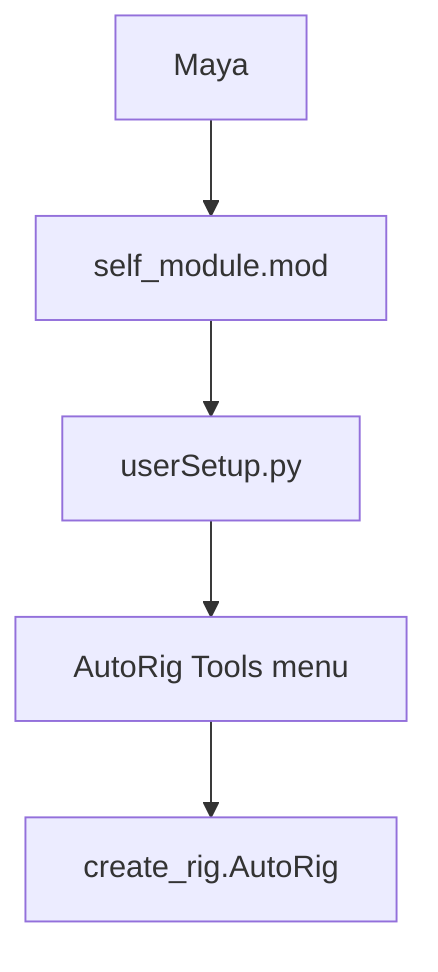

# Autorig Tools - Documentation index

> Entry point for Autorig Tools.
> Language: English (see `.cursor/rules/language.mdc`).
> Children: `maya_tools/`, `ue_tools/`, `modulos/`.

License: Apache-2.0 (`LICENSE`).

---

## Overview

Python (and a small C++ plugin) tools for character autorig in Autodesk
Maya, plus a Unreal Engine notes folder. Not a web app. Not a Docker
stack.

Maya loads the package through `maya_tools/self_module.mod`, which lists
known clone roots (first folder that exists). Copy that file to
`Documents/maya/modules/` or set `MAYA_MODULE_PATH` to `maya_tools`.
On Maya start, `maya_tools/scripts/userSetup.py` builds the AutoRig Tools
menu, the AutoRig shelf, optional numpy, `proxy_locator`, and a localhost
MCP listener. Install steps: `README.md`.

Unreal: `ue_tools/` holds production notes and an empty `scripts/`
placeholder. There is no Unreal plugin in this repo yet.

Product vision: `modulos/vision/how_it_works.md`.
Maya UI criteria: `maya_tools/criterios-ui.md`.
Where a source is shown: `modulos/vision/mapa_datos.md`.
Parked for delivery: `modulos/vision/pendiente_final.md`.

```
autorig_tools/
|-- README.md
|-- LICENSE
|-- maya_tools/          Maya module, scripts, plugin, icons, cache
|-- ue_tools/            Unreal notes + empty scripts placeholder
|-- modulos/             Vision, data map, parked list
|-- .cursor/             Agent rules and skills index
```



---

## Which folder to read

### Read `maya_tools/how_it_works.md` if you need...
- Maya module path, scripts layout, autorig build, tools, plugin, MCP port.

### Read `maya_tools/criterios-ui.md` if you need...
- Menu, shelf, Qt windows. Do not invent a parallel Maya chrome.

### Read `ue_tools/how_it_works.md` if you need...
- Unreal notes and the empty scripts placeholder.

### Read `modulos/how_it_works.md` if you need...
- Vision, data map, parked list.

### Read `modulos/vision/how_it_works.md` if you need...
- Why the repo exists, who uses it. Do not invent a different product story.

### Read `modulos/vision/mapa_datos.md` if you need...
- Where guides, skin, curves, scenes must appear. Do not invent a window.

### Read `modulos/vision/pendiente_final.md` if you need...
- Items parked for delivery.

### Read `.cursor/skills/how_it_works.md` if you need...
- Which Cursor skill to open. None yet.

---

## Summary

| Folder | What it is |
|---|---|
| `maya_tools/` | Maya autorig, tools, UI, C++ collision plugin |
| `ue_tools/` | Unreal notes; scripts not built yet |
| `modulos/` | Operating model and maps for the agent |

Validation: Maya loads `self_module.mod` from `Documents/maya/modules`
or `MAYA_MODULE_PATH`, menu `AutoRig Tools` appears on the Maya menu bar,
shelf `AutoRig` appears. Live code and the `.mod` path are the source of
truth. Human install: `README.md`.
